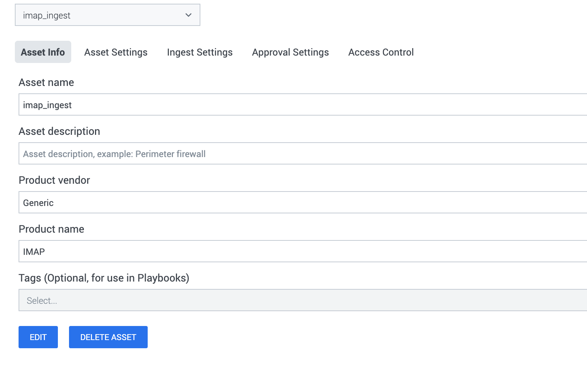
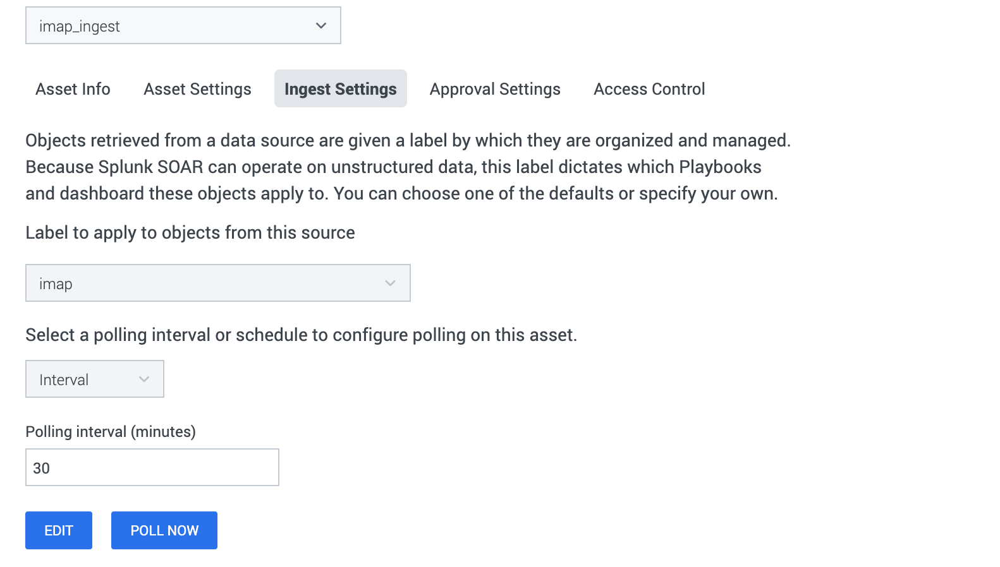
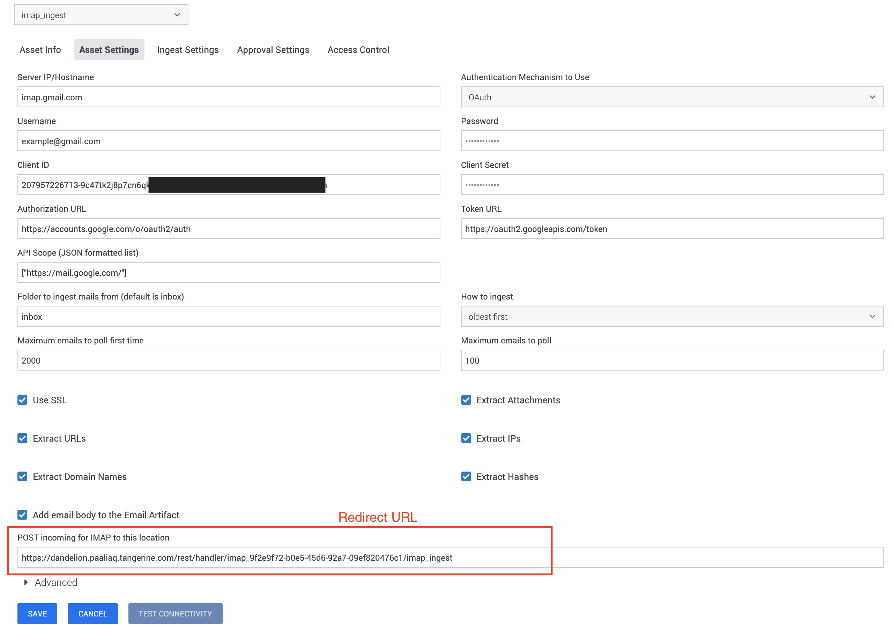
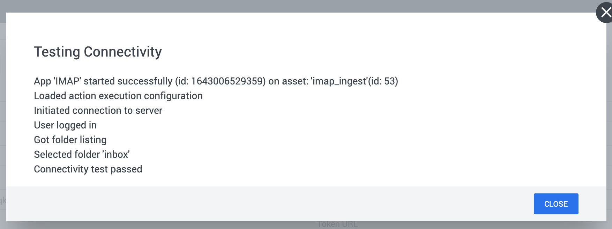
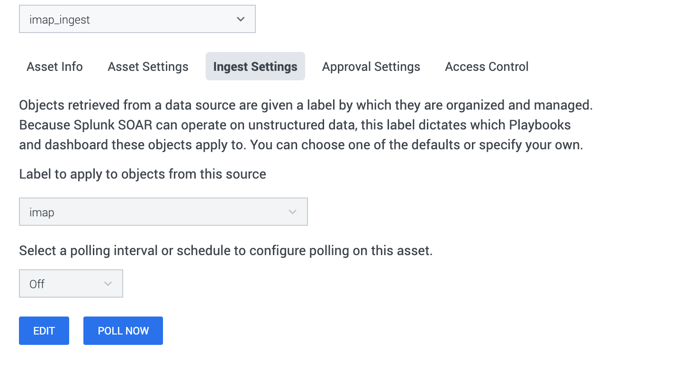

[comment]: # " File: README.md"
[comment]: # "  Copyright (c) 2016-2023 Splunk Inc."
[comment]: # ""
[comment]: # "Licensed under the Apache License, Version 2.0 (the 'License');"
[comment]: # "you may not use this file except in compliance with the License."
[comment]: # "You may obtain a copy of the License at"
[comment]: # ""
[comment]: # "    http://www.apache.org/licenses/LICENSE-2.0"
[comment]: # ""
[comment]: # "Unless required by applicable law or agreed to in writing, software distributed under"
[comment]: # "the License is distributed on an 'AS IS' BASIS, WITHOUT WARRANTIES OR CONDITIONS OF ANY KIND,"
[comment]: # "either express or implied. See the License for the specific language governing permissions"
[comment]: # "and limitations under the License."
[comment]: # ""
# IMAP

It is not uncommon for enterprises to have a single mailbox configured where users can forward
suspicious emails for further investigation. The ingestion feature in the IMAP app is primarily
designed to pull emails from such a mailbox and create containers and artifacts in Phantom.

To add an IMAP Asset in Phantom, from the **Main Menu** , select **Apps** . In the **Search Apps**
field, search for the **IMAP** App by typing "IMAP" into the search field and hitting enter. To the
right of the App name, click on the **Configure New Asset** button.

  
  

In the **Asset Info** tab, the **Asset Name** and **Asset Description** can be whatever you want,
we've chosen "imap_ingest" for this example. The **Product Vendor** and **Product Name** fields will
be populated by Phantom and are not user-configurable. Do not click **Save** yet, navigate to the
**Ingest Settings** tab.

  
  

The **Ingest Settings** tab sets the container type the ingested IMAP data will be placed. Select
the appropriate label name or create a new label. In this example, the label name **imap** has been
selected. Choose "Off" for Manual polling from the dropdown of **Select a polling interval or
schedule to configure polling on this asset** or select "Scheduled" or "Interval". Set the **Polling
Interval** to the desired number of minutes. The settings in the **Approval Settings** and **Access
Control** tab are not used for the communication between Phantom and IMAP and can be configured
later. Navigate to the **Asset Settings** tab if you are not already there.  
  
  
  

The **Asset Settings** tab provides the configuration information Phantom uses to communicate with
the mail server. Currently, there are two ways to authenticate.

-   Basic
-   OAuth

## Basic Authentication

Fill in the **Server IP/Hostname** , **Username** , and **Password** . The remaining configuration
fields can be adjusted to suit the email environment.

## OAuth Authentication

Follow the steps outlined below to set up the OAuth application:

-   Open the [Google API Console Credentials
    page](https://console.developers.google.com/apis/credentials) .
-   Click **Select a project** , then **NEW PROJECT** , and enter a name for the project, and
    optionally, edit the provided project ID. Click **Create** .
    
-   Select the created project from the top left corner, if not already selected.
-   On the **Credentials** page, select **Create credentials** , then **OAuth client ID** .
-   You may be prompted to set a product name on the Consent screen. If so, click **Configure
    consent screen** , supply the requested information, and click **Save** to return to the
    Credentials screen.
-   Select **Web Application** for the **Application Type** . The **Redirect URLs** should be filled
    here. We will get **Redirect URLs** from the Phantom asset we create below in the section titled
    "Phantom asset for IMAP". You can keep it blank for now and Edit/Add it later.
-   Click **Create** .
-   On the page that appears, Note down the **client ID** and **client secret** somewhere secure, as
    you will need them while configuring the Phantom asset.

**Note:** Previously any invocation of **test_connectivity** will start a new Oauth authentication process.
          This is no longer desirable behavior, because when SOAR runs its automated health check for assets
          this will delete any existing (possibly valid) Oauth token and break automated ingestion. We
          changed **test_connectivity** to first check for an existing Oauth token before starting the
          authentication process. If for some reason, you wish to invoke Oauth authentication while an
          existing (possibly bad) token exists you will need to first call the **delete_oauth_token**
          action to delete the existing token.

### Phantom Asset for IMAP

When creating an asset for the **IMAP** app, place the **client ID** and **client secret** in their
corresponding fields. Then, after filling in other values, click **SAVE** . Note that the password
field is optional for OAuth authentication. Keep the default values for the **OAuth Authorization
URL** , **OAuth Token URL** and **OAuth API Scope** parameters.  
  
After saving, a new field will appear in the **Asset Settings** tab. Take the URL found in the
**POST incoming for IMAP to this location** field and place it in the **Redirect URIs** field
mentioned above. You can edit the client listed under **OAuth 2.0 Client IDs** on the
**Credentials** page to add a redirect url. After doing so, the URL should look something like
this:  
  
https://\<phantom_host>/rest/handler/imap_9f2e9f72-b0e5-45d6-92a7-09ef820476c1/\<asset_name>  
  
Additionally, updating the Base URL in the Phantom Company Settings is also required. Navigate to
**Administration \> Company Settings \> Info** to configure the Base URL For Phantom Appliance.
Then, select **Save Changes** .  
  
Once, the asset is configured follow the below steps to generate the access_token and refresh_token
pair.

-   Hit the **TEST CONNECTIVITY** button under **Asset Settings**
-   You will be asked to open a link in a new tab. Open the link in the same browser so that you are
    logged into Splunk Phantom for the redirect. If you wish to use a different browser, log in to
    the Splunk Phantom first, and then open the provided link.
-   Proceed to login to the Google site
-   You will be prompted to agree to the permissions requested by the App
-   If all goes well the browser should instruct you to close the tab
-   Now go back and check the message on the Test Connectivity dialog box, it should say
    Connectivity test passed

**NOTE:**

-   For the IMAP app, we won't be able to route traffic through the proxy. So if the user tries to
    add any proxy in variables of the asset, it won't affect the app's connectivity. But the
    configured proxy variables will be used while generating tokens for the **OAuth authentication**
    .
-   As of now, the OAuth authentication is supported for only Gmail mailbox.
-   The parameter **Use SSL** will be ignored for the **OAuth authentication** , SSL mechanism will
    be used regardless of the parameter value.

  
  

Now that the config is out of the way, let's delve into the two modes, in which ingestion can occur
and the differences between them.

## POLL NOW

Notice that you now have a **Poll Now** button, as shown here:
  
  

Click **Poll Now** . There are a few options you can set, In this example the **Maximum containers**
to 40 and **Maximum artifacts** to 10, the default values are also fine. Click the **Poll Now**
button at the bottom of the dialog. You will see some text begin to scroll by inside the text field,
indicating progress. Parsing data might take a while. The dialog should look like this.

  
  

One thing to note is that for every email that is ingested, a single container is created containing
multiple artifacts. The **Maximum artifacts** value will be ignored and all the possible artifacts
will be ingested into the container.

POLL NOW should be used to get a sense of the containers and artifacts that are created by the app.
The POLL NOW window allows the user to set the "Maximum containers" that should be ingested at this
instance. Since a single container is created for each email, this value equates to the maximum
emails that are ingested by the App. The App will either get the oldest email first or the latest,
depending upon the configuration parameter *How to ingest* .

## Scheduled Polling

This mode is used to schedule a polling action on the asset at regular intervals, which is
configured via the Ingest tab of the asset. It makes use of the following asset configuration
parameters (among others):

-   Maximum emails to poll the first time

      
    The App detects the first time it is polling an asset and will ingest these number of emails (at
    the most).

-   Maximum emails to poll

      
    For all scheduled polls after the first, the app will ingest these numbers of emails.

-   How to ingest

      
    Should the app be ingesting the latest emails or the oldest?

In the case of Scheduled Polling, on every poll, the App remembers the last email that it has
ingested and will pick up from the next one in the next scheduled poll.

### How to ingest

The app allows the user to configure how it should ingest emails on every scheduled poll, *oldest
first* , or *latest first* . Depending upon the scheduled interval and how busy the inbox is one of
the following could potentially happen

-   oldest first

      
    If the app is configured to poll too slowly and the inbox is so busy that on every poll the
    maximum ingested emails is less than the number of new emails, the app will never catch up.

-   latest first

      
    If the app is configured to poll too slowly and the inbox is so busy that on every poll the
    maximum ingested emails is less than the number of new emails, the app will drop the older
    emails since it is ingesting the latest emails that came into the mailbox.

For best results, keep the poll interval and *Maximum emails to poll* values close to the number of
emails you would get within a time interval. This way, every poll will end up ingesting all the new
emails.

## Containers created

As mentioned before, the app will create a single container for each email that it ingests with the
following properties:

-   Name

      
    The email subject is used as the name of the container. If a subject is not present the
    generated name is of the format: "Email UID: the_numeric_email_id"

-   Source ID

      
    The source ID of the container will be set to the "{hash_value_of_foldername} : {email_id}".

The **data** section of the container will contain the complete raw email in a key named
'raw_email'. The UI allows the user to download this raw data JSON into a file. This same data can
be extracted in a playbook also for further processing.

## Playbook Backward Compatibility

-   The existing container's source_data_identifier has been modified. Hence, it is requested to the
    end-user to please update their existing playbooks by re-inserting | modifying | deleting the
    corresponding action blocks or by providing appropriate values to the action parameters in case
    source_data_identifier is used, to ensure the correct functioning of the playbooks created on
    the earlier versions of the app.
-   The format of container source_data_identifier has been changed from "{email_id}" to
    "{hash_value_of_foldername} : {email_id}" which helps to create containers correctly while
    fetching data from the IMAP server.

## Artifacts created

The App will create the following type of artifacts:

-   Email Artifact

      
    The email addresses that are found in the ingested email will be added as a separate artifact.
    Any attached email will also be scanned and the address present in the attached email will be
    added as a separate artifact. The emails are added as custom strings in the CEF structure in the
    following manner.

    | **Artifact Field** | **Value Details**                                                                  |
    |--------------------|------------------------------------------------------------------------------------|
    | Source ID          | Email ID set on the server                                                         |
    | cef.fromEmail      | From email address                                                                 |
    | cef.toEmail        | To email address                                                                   |
    | cef.emailHeaders   | A dictionary containing each email header as a key and it's value as the key-value |

    

-   IP Artifact
    -   If **extract_ips** is enabled, any IPv4 or IPv6 found in the email body will be added, with
        one CEF per IP.
    -   Any IP addresses found in the email are added to the CEF structure of an artifact.
    -   The CEF for an IP is cef.sourceAddress.

-   Hash Artifact - cef.fileHash

      

    -   If **extract_hashes** is enabled, any hash found in the email body will be added, with one
        CEF per hash.
    -   Any Hashes found in the email are added to the CEF structure of an artifact.
    -   The CEF for a hash is cef.fileHash.

-   URL Artifact - cef.requestURL

      

    -   If **extract_urls** is enabled, any URL found in the email body will be added, with one CEF
        per URL.
    -   Any URLs found are added to the CEF structure of an artifact.
    -   The CEF for a URL is cef.requestURL.

-   Domain Artifact - cef.destinationDnsDomain

      

    -   If **extract_domains** is enabled, any domain found in the email body will be added, with
        one CEF per domain.
    -   Domains that are part of a URL or an email address are added to the CEF structure of an
        artifact.
    -   The CEF for a URL is cef.destinationDnsDomain.

-   Vault Artifact

    -   If the email contains any attachments, these are extracted (if enabled in the config) and
        added to the vault of the Container.
    -   At the same time, the vault id and file name of this item is represented by a Vault
        Artifact.
    -   The same file can be added to the vault multiple times. In this scenario, the file name of
        the item added the second time onwards will be slightly different, but the vault id will
        still be the same. However, there will be multiple artifacts created.
    -   Do note that the system does *not* duplicate the file bytes, only the metadata in the db.
        | **Artifact Field** | **Value Details**                   |
        |--------------------|-------------------------------------|
        | Source ID          | Email ID set on the server          |
        | cef.vaultID        | Vault ID of the attachment          |
        | cef.fileName       | Attached filename used in the email |
    -   You will notice additional CEF fields **cs6** (value is the Vault ID) and **cs6Label** .
        These are added for backward compatibility only and will be deprecated in future releases.
        Please don't use these keys in playbooks.

      
    \*\* Since the vault id cannot be represented by a native CEF field, it is placed in the **cs6**
    CEF key and the cs6Label key is set to "vault_id".
    

## Port Information

The app uses IMAP protocol for communicating with the email servers and HTTP/ HTTPS protocol for
obtaining/refreshing the access_token. Below are the default ports used by Splunk SOAR.

|         Service Name | Transport Protocol | Port |
|----------------------|--------------------|------|
|         http         | tcp                | 80   |
|         https        | tcp                | 443  |

Below are the ports used by IMAP library for the connection.

|         Service Name   | Transport Protocol | Port |
|------------------------|--------------------|------|
|         Standard IMAP4 | tcp                | 143  |
|         IMAP4-over-SSL | tcp                | 993  |
